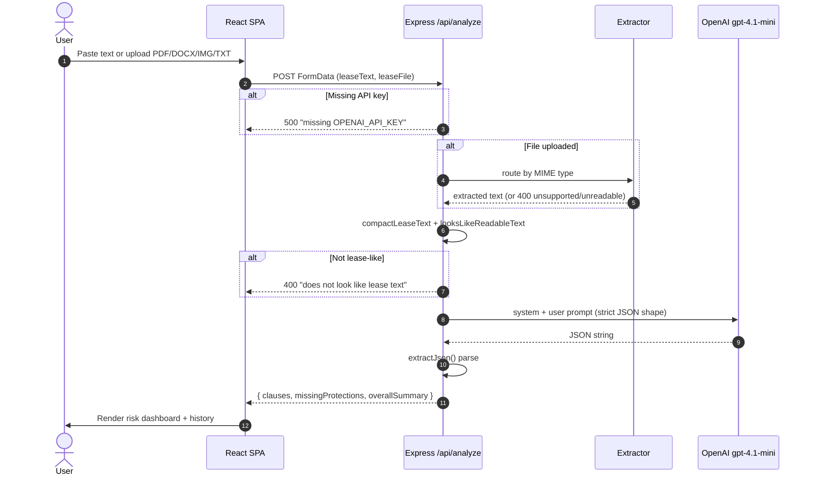
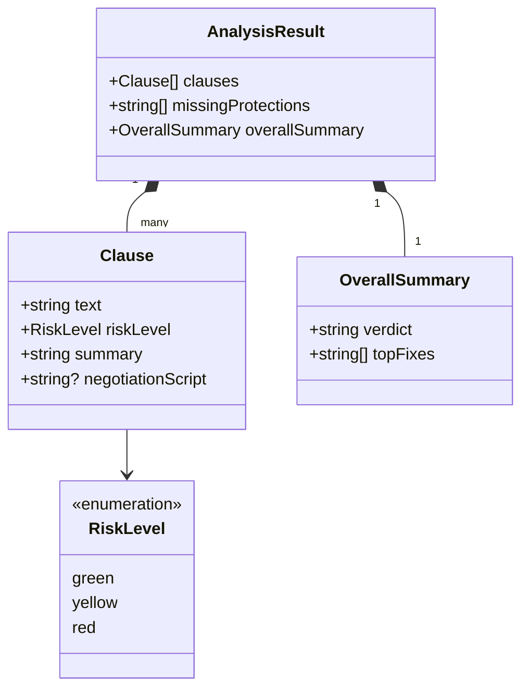

# Lease Contract Red-Flag Scanner — System Architecture

A two-tier web app: a **React/Vite SPA** for input & visualization, and an **Express API**
that extracts text from uploads, validates it, and calls **OpenAI** to produce a structured
renter-risk report.

---

## 1. High-level architecture

```mermaid
flowchart TB
    subgraph Browser["🌐 Browser (localhost:5173)"]
        UI["React SPA — App.jsx<br/>paste text · upload file · drag &amp; drop"]
        RES["Results UI<br/>Executive snapshot · Risk dashboard<br/>Missing protections · History"]
    end

    subgraph Vite["⚡ Vite Dev Server :5173"]
        PROXY["/api proxy → :4000"]
    end

    subgraph Backend["🖥️ Express API :4000 (server.js)"]
        MULTER["multer<br/>memory storage · 15 MB limit"]
        ROUTE["POST /api/analyze"]

        subgraph Extract["Text extraction (by MIME type)"]
            PDF["PDF → pdfjs-dist"]
            DOCX["DOCX → mammoth"]
            IMG["image → tesseract.js OCR"]
            TXT["text/plain → utf8"]
        end

        subgraph Guard["Validation"]
            COMPACT["compactLeaseText<br/>normalize · cap 18k chars"]
            READABLE["looksLikeReadableText<br/>lease-term heuristic"]
        end

        PARSE["extractJson<br/>slice &#123; … &#125; · JSON.parse"]
    end

    subgraph OCRAsset["📦 eng.traineddata"]
        TD["Tesseract English model"]
    end

    subgraph OpenAI["🤖 OpenAI API"]
        LLM["chat/completions<br/>model: gpt-4.1-mini<br/>temp 0.2 · max_tokens 900"]
    end

    UI -->|"FormData: leaseText / leaseFile"| PROXY
    PROXY --> ROUTE
    ROUTE --> MULTER --> Extract
    IMG -.loads.-> TD
    Extract --> Guard
    Guard -->|"valid lease text"| ROUTE
    ROUTE -->|"system + user prompt"| LLM
    LLM -->|"JSON string"| PARSE
    PARSE -->|"clauses · missingProtections · overallSummary"| RES
    RES --> UI

    Guard -.->|"400 error"| RES
    LLM -.->|"500 error"| RES
```



---

## 2. Request lifecycle (sequence)



---

## 3. Analysis result contract



---

## 4. Component & tech map

| Layer | Tech | Responsibility |
|-------|------|----------------|
| **Frontend** | React 18, Vite 5 | SPA, drag-drop upload, risk dashboard, in-session history |
| **Dev proxy** | Vite `server.proxy` | Forwards `/api` → `:4000` (avoids CORS in dev) |
| **API** | Express 4 | Single `POST /api/analyze` endpoint |
| **Uploads** | multer (memory, 15 MB) | Buffers file in RAM, no disk writes |
| **PDF** | pdfjs-dist (legacy build) | Page-by-page text extraction |
| **DOCX** | mammoth | Raw text extraction |
| **OCR** | tesseract.js + `eng.traineddata` | Image → text (lazy-initialized worker) |
| **Validation** | custom heuristics | Normalize, cap 18k chars, reject non-lease content |
| **LLM** | OpenAI `gpt-4.1-mini` | Clause risk scoring + negotiation scripts |
| **Config** | dotenv (`.env`) | `OPENAI_API_KEY`, `PORT` |

---

## 5. Notable engineering observations

- **Stateless API** — no DB; "history" lives only in React state and is lost on refresh.
- **Lazy OCR worker** — `ensureWorker()` initializes Tesseract once, on first image upload, and caches it.
- **Self-healing port bind** — on `EADDRINUSE`, `server.js` runs `lsof`/`kill -9` to free `:4000` and retries.
- **Defensive JSON parsing** — `extractJson()` slices the first `{` … last `}` to survive minor LLM formatting noise.
- **Two input paths converge** — pasted text takes precedence over an uploaded file's extracted text.

### Potential hardening (future)
- API key only server-side ✅ — keep it that way; never expose to the client.
- Add a request timeout / retry around the OpenAI `fetch`.
- Consider streaming or chunking for leases beyond the 18k-char cap (currently truncated).
- Persist history (localStorage or a DB) if cross-session history is desired.
```
