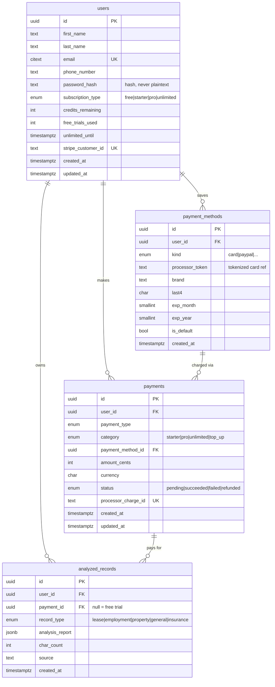

# Database Architecture (PostgreSQL)

Schema for the Contract Red-Flag Scanner, derived from the `User / Payments /
Analyzed_Records` model. Apply with:

```bash
psql "$DATABASE_URL" -f db/schema.sql
```

## Entity-relationship diagram



## Relationships (the arrows in the sketch)

| From | To | Cardinality | Meaning |
|------|----|-------------|---------|
| `users` | `payments` | 1 → many | a user makes many payments |
| `users` | `analyzed_records` | 1 → many | a user owns many reports |
| `users` | `payment_methods` | 1 → many | a user saves multiple cards (replaces `Saved_Card_Info`) |
| `payment_methods` | `payments` | 1 → many | a saved card is charged repeatedly |
| `payments` | `analyzed_records` | 1 → many | a payment/subscription funds analyses (`payment_id` is `NULL` for the free trial) |

## Key design decisions

- **UUID primary keys** (`gen_random_uuid()`) — safe to expose in URLs/APIs, no enumeration, merge-friendly.
- **`password_hash`, never `password`** — store a bcrypt/argon2 hash only.
- **No raw card data** — `Saved_Card_Info`/`Card_Info` become a tokenized
  `payment_methods` row (`processor_token` + `brand`/`last4`/`exp`). Storing a
  full PAN or CVV violates PCI-DSS; tokenization keeps you out of scope.
- **`analysis_report` as `JSONB`** — the model's structured output
  (`clauses`, `missingProtections`, `overallSummary`) maps 1:1 and is queryable
  via the GIN index.
- **`TIMESTAMPTZ` everywhere** — timezone-aware, `now()` defaults.
- **Enums** for `subscription_type`, `payment_category`, `payment_status`,
  `record_type` — aligned with the app's plans and contract types.
- **`updated_at` triggers** + indexes on every foreign key and common filter.
- **`ON DELETE CASCADE`** for a user's children; **`SET NULL`** on
  `analyzed_records.payment_id` so deleting a payment never erases the report.
